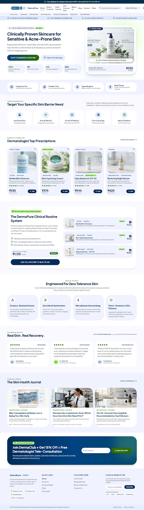

# DermaPure & DermCare • Clinical Skincare E-Commerce Themes

A high-converting, multi-page clinical skincare e-commerce store engineered with Tailwind CSS, vanilla JavaScript, and persistent local cart state.



---

## 🌟 Key Features

### 1. Complete Multi-Page Store Funnel (`theme-dermapure/`)
- **Home Page (`index.html`)**: Clinical barrier defense narrative, trust badges, 4-column bestsellers with 1-click add-to-cart, 3-step routine system with live bundle pricing recalculator, and VIP membership discount trigger.
- **Skincare Catalog (`collection.html`)**: Dynamic client-side filtering by **Skin Concern**, **Category**, **Key Actives**, **Price Slider**, and **Sort dropdown** (Price Low-High, High-Low, Rating, Recommended).
- **Product Detail Page (`product.html`)**: Interactive thumbnail switcher, volume radio selectors (125ml, 250ml, 500ml), quantity counter, Indian pincode delivery estimator, and clinical evidence tabs.
- **Interactive Routine Builder (`routine-builder.html`)**: 3-step diagnostic wizard allowing users to diagnose their barrier concern, customize AM/PM layers (Cleanser, Moisturizer, SPF), and save 15% on the entire bundled regimen.
- **Clinical Checkout (`checkout.html`)**: 3-step patient checkout with address capture, delivery speed toggle, multiple payment methods (**UPI QR**, **Credit/Debit Cards**, **Cash on Delivery**), and order confirmation modal.
- **Global Cart Engine (`store.js`)**: Slide-out cart drawer with free shipping progress tracker (threshold: ₹999), coupon engine (`DERMA10`, `WELCOME15`), and floating toast notifications.

### 2. Alternative Theme Variant (`theme-dermcare/`)
- Clinical laboratory aesthetic utilizing the **Inter** font family, alternative color tokens, and SVG circular study results.

### 3. Central Themes Hub (`index.html`)
- Interactive viewport simulator allowing live testing of all pages across **Desktop (100%)**, **Tablet (768px)**, and **Mobile (390px)**.

---

## 📁 Repository Structure

```
.
├── index.html                   # Themes Studio Hub & Responsive Simulator
├── theme-dermapure/             # Flagship 5-Page Clinical Store
│   ├── index.html               # Home Page
│   ├── collection.html          # Skincare Catalog
│   ├── product.html             # Gentle Skin Cleanser PDP
│   ├── routine-builder.html     # Interactive Regimen Builder
│   ├── checkout.html            # Clinical Checkout & Order Confirmation
│   ├── store.js                 # Cart State & Slide-Out Drawer Engine
│   └── DESIGN.md                # Material Theme Builder Tokens & Specs
├── theme-dermcare/              # Alternative Design Variant
│   ├── index.html               # Home Page
│   ├── product.html             # Product Page
│   └── DESIGN.md                # Design System Specs
└── stitch_e_commerce_store_website_design/ # Raw exported assets & screens
```

---

## 🚀 Getting Started

Simply open `index.html` in any modern web browser or serve locally:

```bash
# Using python HTTP server:
python3 -m http.server 8000

# Open in browser:
# http://localhost:8000
```
